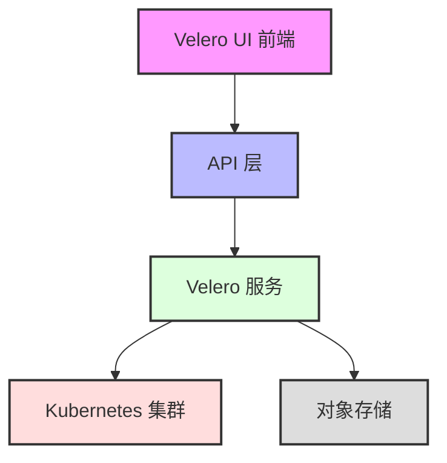
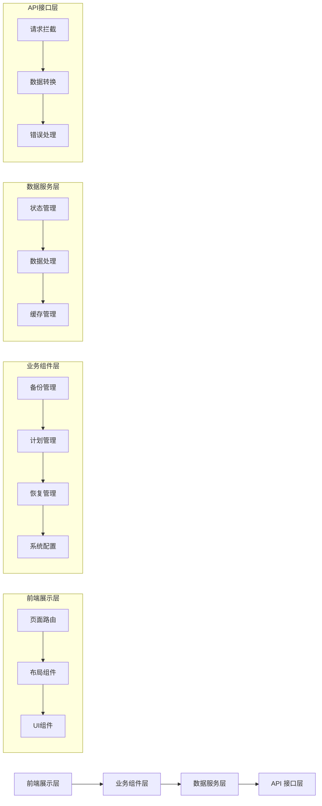
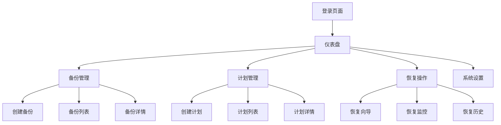

# Velero UI 项目说明文档

## 1. 项目简介
Velero UI 是一个为 Velero 备份工具提供图形化界面的前端项目。通过这个界面，即使不熟悉命令行的用户也能轻松管理 Kubernetes 集群的备份和恢复操作。

## 2. 系统架构


## 3. 详细功能说明

### 3.1 首页仪表盘
- **概览面板**
  - 显示备份任务总数
  - 当前正在进行的备份数
  - 最近失败的备份数
  - 系统健康状态指标
- **快速操作区**
  - 快速创建备份按钮
  - 快速恢复按钮
  - 查看最近备份记录

### 3.2 备份管理
- **备份任务列表**
  - 展示所有备份任务
  - 支持按状态筛选（进行中/完成/失败）
  - 支持按时间范围筛选
  - 支持按备份名称搜索
  
- **创建备份**
  - 选择备份范围
    - 整个集群备份
    - 指定命名空间备份
    - 选择特定资源备份
  - 设置备份选项
    - 备份名称
    - 保留策略
    - 包含/排除资源
    - 快照选项
  
- **备份详情页**
  - 基本信息展示
  - 备份进度实时显示
  - 资源清单
  - 日志查看
  - 错误信息展示

### 3.3 备份计划管理
- **计划列表**
  - 显示所有定时备份计划
  - 计划状态监控
  - 下次执行时间提示
  
- **创建备份计划**
  - 设置计划名称
  - 配置定时规则（Cron 表达式）
  - 备份范围设置
  - 保留策略设置

### 3.4 数据恢复
- **恢复向导**
  - 选择备份源
  - 选择恢复范围
  - 配置恢复选项
  - 确认和执行
  
- **恢复监控**
  - 实时进度展示
  - 资源恢复状态
  - 错误提示和处理

### 3.5 系统配置
- **存储位置管理**
  - 配置备份存储位置
  - 存储凭证管理
  
- **集群设置**
  - Velero 服务配置
  - 权限管理
  - 资源限制设置

## 4. 技术架构详解


## 5. 用户界面预览


## 6. 功能特性
- Kubernetes 集群备份管理
  - 创建/删除/修改备份
  - 查看备份状态和详情
  - 备份历史记录查询
- 备份计划管理
  - 创建定时备份计划
  - 管理现有备份计划
  - 计划执行状态监控
- 数据恢复操作
  - 从备份中恢复数据
  - 恢复操作监控
  - 恢复历史记录
- 系统监控
  - 备份任务状态监控
  - 系统资源使用监控
  - 操作日志查看

## 7. 技术架构
### 7.1 前端技术栈
- 框架：Vue.js
- 包管理：Yarn
- 开发服务器：json-server (模拟API)
- 构建工具：Vue CLI
- 测试框架：
  - 单元测试：Jest
  - E2E测试：Cypress

### 7.2 开发环境要求
- Node.js
- Yarn
- Docker & Docker Compose
- Minikube (本地开发)
- Velero CLI

## 8. 开发指南
### 8.1 本地开发环境搭建
1. 安装依赖
```bash
yarn install
```

2. 启动开发服务器
```bash
cd json-server
json-server --watch db.js --routes routes.json -p 8081
cd ..
yarn serve
```

3. 本地集群配置
```bash
cd /tmp
wget https://raw.githubusercontent.com/tellesnobrega/velero-demo/master/minio.credentials
minikube start
git clone https://github.com/kubernetes-sigs/sig-storage-local-static-provisioner.git 
cd sig-storage-local-static-provisioner/
helm install local-storage --namespace velero ./helm/provisioner
```

### 8.2 Docker 部署
```bash
docker build . -t velero-build --target build-stage
docker build . -t velero --cache-from velero-build
docker-compose up -d
```

## 9. 测试
### 9.1 单元测试
```bash
yarn test:unit
```

### 9.2 E2E测试
```bash
yarn test:e2e
```

### 9.3 代码检查
```bash
yarn lint
```

## 10. 构建部署
### 10.1 生产环境构建
```bash
yarn build
```

## 11. 项目结构
```
velero-ui/
├── src/               # 源代码目录
├── public/            # 静态资源
├── json-server/      # 模拟API服务器
├── tests/            # 测试文件
├── docker/           # Docker相关配置
└── docs/             # 项目文档
```

## 12. 注意事项
- 本项目目前处于开发阶段(WIP)
- 使用前请确保已正确配置Kubernetes集群
- 需要正确配置Velero的访问权限
- 建议在测试环境中充分测试后再部署到生产环境

## 13. 贡献指南
[待补充]

## 14. 许可证
[待补充] 